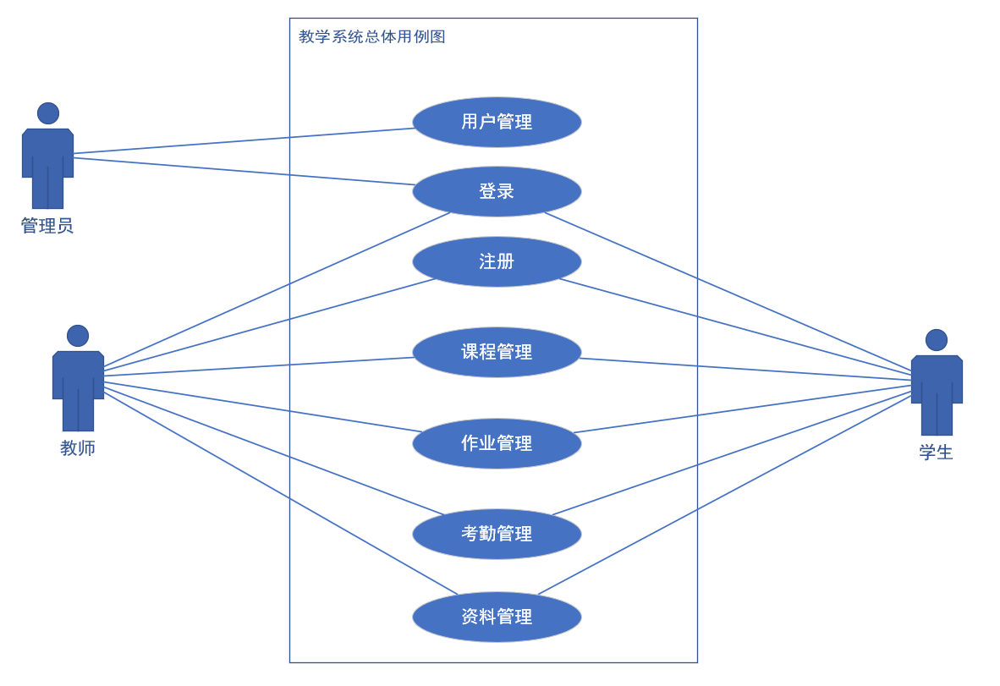
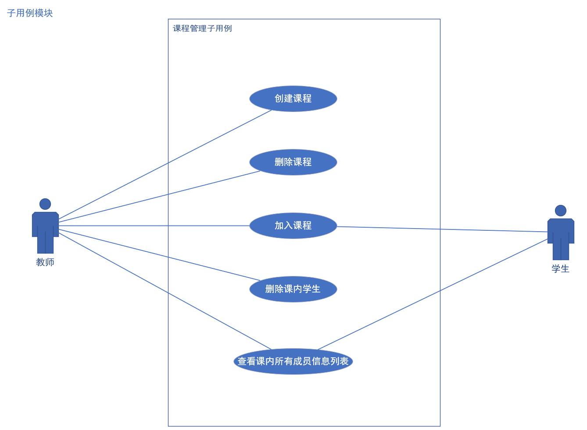
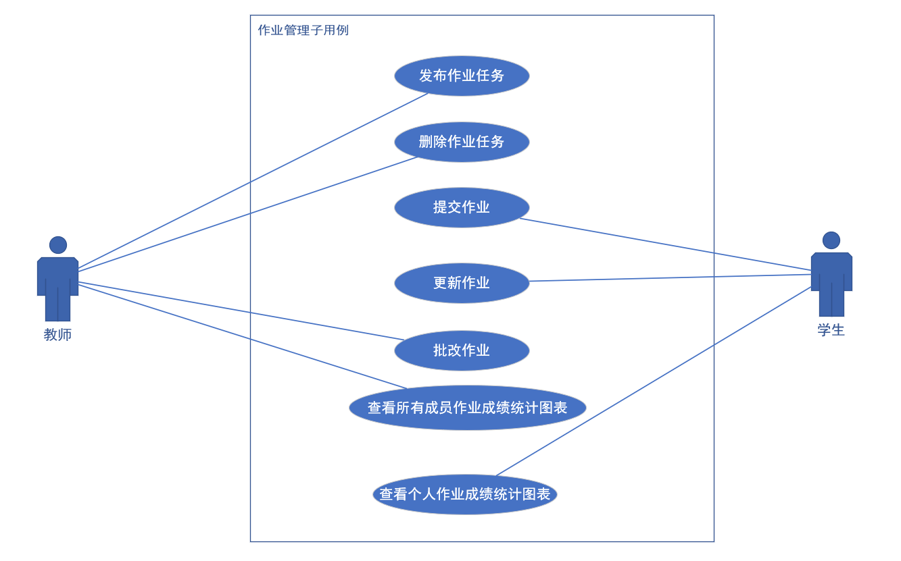
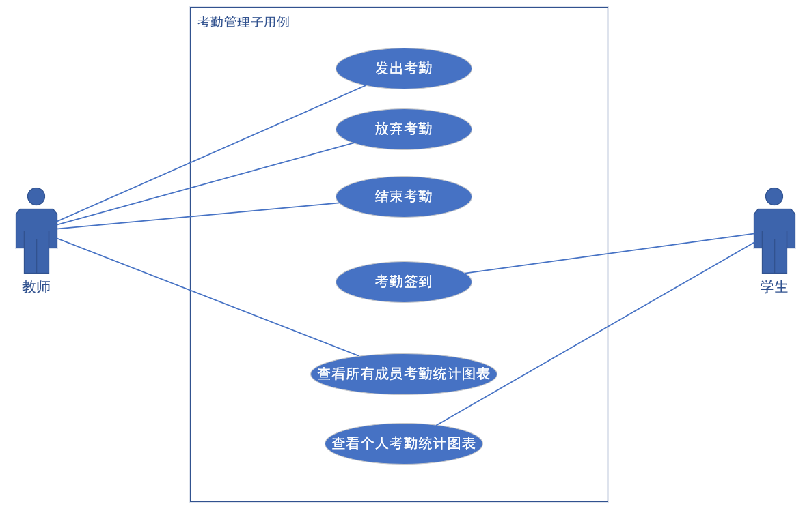
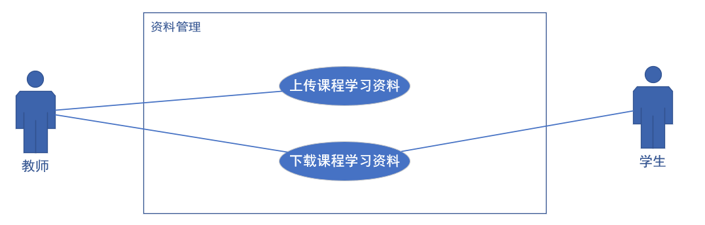
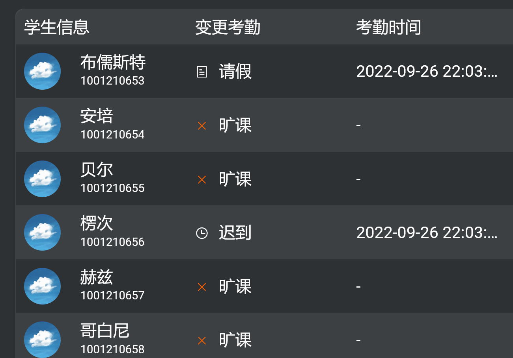

欢迎使用 **{小书匠}(xiaoshujiang)编辑器**，您可以通过 `小书匠主按钮>模板` 里的模板管理来改变新建文章的内容。

欢迎使用 **{小书匠}(xiaoshujiang)编辑器**，您可以通过 `小书匠主按钮>模板` 里的模板管理来改变新建文章的内容。
-----
 
有效练习的四个特点：
- 具有定义明确的特定目标
- 保持专注
- 包含反馈
- 走出舒适区

* * *
## 流程
### 教学用户需求
教学系统，用户为：教师，学生
管理员仅作为系统后台维护者。
用户（教师，学生），均可以注册信息、登录系统；查看和修改个人信息，修改密码，退出。

教师通过教师入口登录系统后，可以创建新课程，并在创建时填写课程基本信息，删除课程；可以查看所开设课程；可以发布签到，查看班级内各成员考勤信息；可以发布和批改作业，查看班级内各成员的作业成绩；可以上传或下载课程资料。

学生通过学生入口登录系统后，可以查看所加入的课程；通过课程码加入新课程；可以进行签到，查看个人考勤信息；提交和更改作业，查看个人作业成绩；下载课程资料。

### 教学系统基本业务需求
 * 登录注册：用户选择教师/学生身份进行注册，注册后方可通过入口登录。
 * 用户管理：管理员权限功能，可以新增用户，查询用户 或 删除用户，**对于修改用户信息，之后再进行完善**
以上基本功能；

以下主要功能；
 * 课程管理：
	 * 创建课程，==设置课程信息 #00BCD4==
		 * 教师为该课程创建者
	 * 删除课程
		 * 教师通过验证信息删除掉该课程-> 与该课程有关的所有外键列均被强制性删除（**级联删除**）；学生登录后，也无法再课程列表中查看到该课程。
	 * 查看课程内成员
		 * 以列表的形式展示所有成员信息即身份，教师可以选择删除成员中的任意一个学生。删除后，表示该学生已退课，学生查询不到该课程。学生不能自己退课，只能让老师来退课。
	 * 加入课程
		 * 学生可以通过老师分享的**邀请码（/加课码）** 加入指定的课程。

- - -
 * 作业管理：
	* 发布作业 
		*  由教师在某一个课程内发布作业，记录发布人，所在课程ID，作业信息表 （一个表+两个外键）
	* 删除作业 
		* 教师发完作业，感觉这个作业不太对，又把它给删掉；删掉后，作业提交表中的所有相关外键记录全部被删掉（级联删除）
	 *	提交作业
		 *	学生 - 提交 - 作业
		 *	提交作业到远程的一个文件夹中，相当于把文件上传到远程服务器
			 *	需要记录——提交的路径，提交的作业文件名称
		 *	其实对于作业，老师和学生之间应该有可以交流的情况，不然学生如何判断自己行不行呢？
		 *	但是这种作用也应该是聊天功能或论坛功能或话题功能的事情，因此无法进行，后续完善吧。
	* 更新作业
		* 删掉之前的文件
		* 重新提交
		* （这就需要进入提交-作业表的编辑状态）
	 * 批改作业：
		 * List形式展示班级内所有成员的作业，点击进入查看作业情况（查看的是 提交-作业表）
		 * 老师需要下载提交的作业，进行查看
		 * 能不能实现在线查看呢？—— 需要看具体的实现情况
	* **==作业统计 #F44336==**（1 提没提交 ；2 成绩展示 ）：
		* 作业提交情况统计
		* 作业批改情况统计
			 
为已批改的，未批改的，未提交的
	
  * 用视图的方式把学生的作业统计出来，进行展示（点击刷新按钮即可动态刷新）
 **历时作业记录**
		  
		  
---
 * 考勤管理：
	* 发出考勤 （考勤表-发起人-> 教师和学生的界面不同）
	* 放弃考勤 
		* 点击放弃考勤，所有与之有关的考勤信息（外键级联删除）都会被删掉
	* 结束考勤
		* 考勤结束。
    * 考勤签到
		* 学生签到成功，添加记录
	 *	==考勤统计 #F44336==
		* 学生签到分为，签到成功和签到不成功的情况
		* 考勤提交记录情况报表 - 即为考勤的统计

**历时考勤记录**

 * 资料管理：
	* 上传资料
	* 下载资料
以下附带功能
 * 数据统计：
作业统计
考勤统计
是动态显式的数据，所以不需要额外记录，直接通过视图展示
一直是在变化着的，没办法把它固定了吧

### 系统功能用例如下：
#### 总体用例

#### 课程管理

#### 作业管理

#### 考勤管理

#### 资料管理

### 数据需求分析
#### 基本数据字典
* 用户信息：
	* 数据项：用户ID，姓名，密码，电话，角色名称，角色权限，所属学校，所属院系，编号（工号/学号）
	* 创建时间，更新时间
* 课程信息：
	* 数据项：课程IDcourse_id，课程名称，加课码，课程介绍，所在学年，所在学期，课程创建人(fk_user_id)。
	* 创建时间，更新时间

* 用户-参与-课程信息：
	* 数据项：参与-课程ID，总成绩，参与学生ID，参与课程ID
	* 创建时间，更新时间

* 作业信息：
	* 数据项：作业ID，作业标题，作业内容，作业附件路径，作业附件名称，作业是否已被删除，作业发布时间，作业截止时间，==作业发布人，作业所属课程 #2196F3==
	* 作业创建时间
	* 作业更新时间
   * 不行，还是要添加的
	
	作业统计记录：—— 动态记录-已提交（已批阅，未批阅）--都可以直接从提交-作业表中获取，对于未提交的，通过数据库查询，**形成未提交名单视图**，或是创建一张表，在插入之前，先删除之前的数据，再添加？
		
		
* 提交-作业信息：-作业提交信息记录
	*	数据项：提交-作业ID，得分，提交的附件位置，提交的附件名称，作业备注，作业状态0-未批阅，1已经批阅，教师评语，学生ID，所属作业ID
	*	创建时间
	*	更新时间 - 提交时间
    * 提交的时候添加信心，不提交，不添加
	*	进行作业更新时，只能更新文件位置，文件名称，作业备注 - 学生
	*	老师：得分，评语是老师写的
	**学生最终成绩记录视图（只有：学生ID，作业ID，作业标题，时间，得分）**
	
	
* 考勤信息：
	* 数据项：考勤ID，**考勤类型（0-只有数字考勤），考勤信息（即随机生成的数字**），考勤时长，是否已经结束(is_over)，考勤发布人，考勤的课程
	* 创建时间，更新时间
签到类型分为：出勤，迟到，旷课 （数字签到只能签：出勤，迟到，旷课）
* 制定时间内签到 - 出勤
* 指定时间外签到 - 旷课
* 剩余的需要和老师说明情况：
	* 出勤
	* 旷课
对于请假，迟到和早退，只能麻烦老师手动修改了
* 请假获得请假信息
* 迟到，来了，但是考勤已经结束，就请假
* 早退，系统无法检测，只能老师手动修改
	* 请假
	* 迟到
	* 早退

* 签到记录表信息
	*   数据项：签到ID，签到时间，签到结果（出勤，旷课，迟到，请假，早退），签到学生ID，所属考勤ID
点击考勤记录，考勤信息就这样展示出来：
如何展示的呢？
	* 点击某一个考勤项->考勤ID->查询：学生-签到表
		* 确定了已经签到的学生，
	* 在根据学生-签到表中已经签到了的学生ID
		  * 确定旷课的学生->他们也以列表的形式展示
展示的列表是：学生信息 + 考勤时间 + 考勤结果
对于旷课的：没有考勤时间
点击更改考勤信息后，将学生的考勤信息添加到 - 
学生-签到表中

我该怎么实现这种情况呢?
出勤，旷课，迟到，早退，请假 不分开来列出了。
全部在一列中显式出来。
* 每创建一次考勤 -> 修改考勤表 ->修改考勤签到表（添加学生ID，考勤ID，全部默认为旷课）
* 学生点击签到->更改签到记录表 -> 修改对应签到结果+签到时间
* 老师更改 -> 更改签到记录表 ->修改对应签到结果+签到时间

资料表先不搞了
* 资料信息：
	* 资料ID，资料名称，资料说明，资料路径，资料发布人ID，资料所在班级ID

---------------
 
* 公告管理：—— 这个可以单独作为一张表。
	* 提示作业已经发布
	* 提醒那些没有交的同学，快点交作业。
* 话题管理：
---
文件的上传和下载就是需要文件路径+文件名称

#### 数据流图

实在是搞不出来，就不搞了

### 确定数据库

### 后台数据库基本搭建

### 学习Vue基础+框架使用

### 设计页面+搭建页面

### 后台数据完善，功能完善

