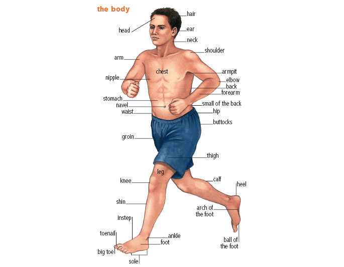

欢迎使用 **{小书匠}(xiaoshujiang)编辑器**，您可以通过 `小书匠主按钮>模板` 里的模板管理来改变新建文章的内容。

## Vocabulary
- canyon 
a deep valley with steep sides of rock = gorge
The Grand canyon is one of the natural wonders of the world.
- stretch 
make bigger or looser
pull tight
your body：to put your arms or legs out straight and contract your muscles.
over area: to spread over an area of land = extend

- cliff
a high area of rock with a very steep side, often at the edge of the sea or ocean.
- wear wore
to become, or make sth become thinner, smoother or weaker through continuous use or rubbing.
wear sth down
to make sb/sth weaker or less determined, especially by continuously attacking or putting pressure on them or it over a period of time.

* reshape
	* to change the shape or structure of sth
* batter
	* to hit sth hard many times, especially in a way that causes serious damage.
* surround 
	* surround sth/sb
	* surround sth/sb by/with sth
	* Tall trees surround the lake.
* Brazil 
	* a contry in south America
* dolphin
	* a sea animal (a mammal) that looks like a large fish with a pointed mounth. Dolphins are very intelligent and often friendly towords humans. There are several types of dolphin.
* corn 
	* the yellow seeds of a type of corn(maize) plant, also called corn, which grow on thick stems and cooked and eaten as a vegetables.
* hunt
	* Whales are still being hunted and killed in the Arctic.
* Swing 
	* hang and move
	* move in curve（a line or surface that bends gradually; a smooth bend）
* race
	* competition
		* He is already in training for the big race against Bailey.
		* Their horse finished third in the race last year
* ladder
	* a piece of equipment for climbing up and down a wall, the side of a building, etc., consisting of two lengths of wood or metal that are joined together by steps or rungs.
* heritage
	* the history, traditions, and qualities that a country or society has had for many years and that are considered an important part of its character
	* The building is part of our national heritage.
* immigrant
	* a perpon who has come to live permanently in a country that is not their own.
	* illegal immigrants
* express
	* to show or make known a feeling, an opinion, etc. by words, looks, or actions
	* His views have been expressed in numerous speeches.
	* express fears.
	* have a difficulty expressing herself
* culture
	* The children are taught to respect different cultures.
	* The effect of technology on traditional cultures.
* appreciate 
	* to recognize the good qualities of someone or something
	* You can't really appreciate foreign literature in translation.
* demand
	* demand (for something/that…) a very firm request for something; 
* waist
  
  
  
  * Later on, states passed laws that said people must wear seat belt
  
  * design
	  * The magazine will appear in a new design from next month.
	  * designs for aircraft
	  * new and orginal design (a drawing or plan from which something may be made)