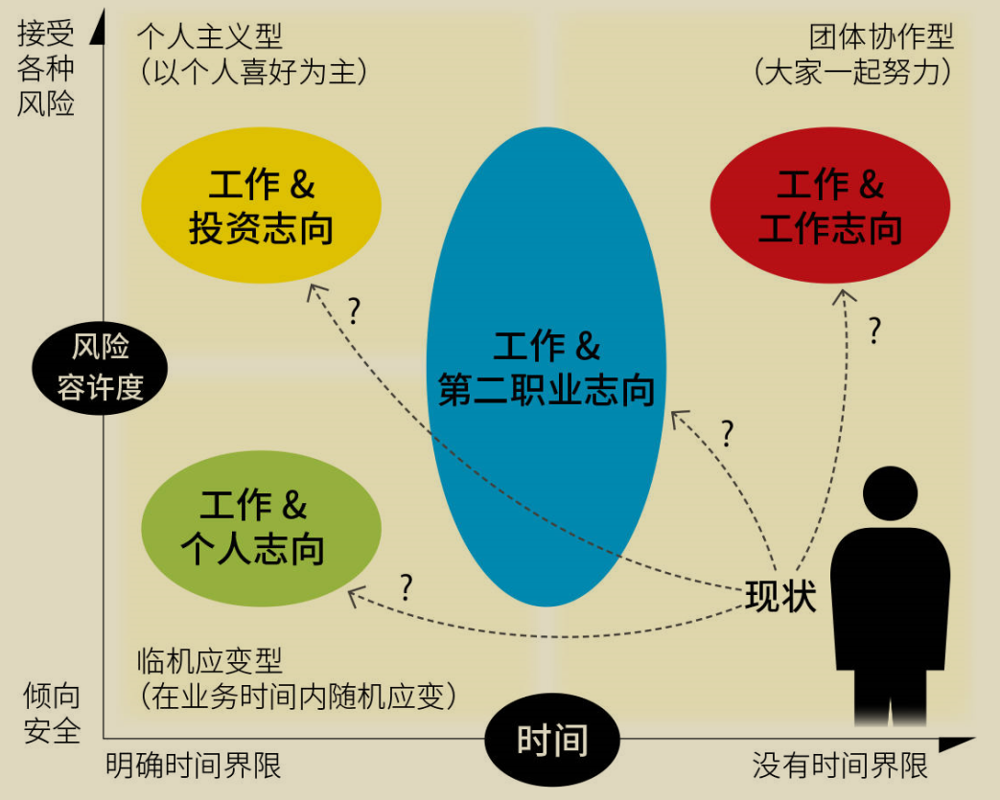
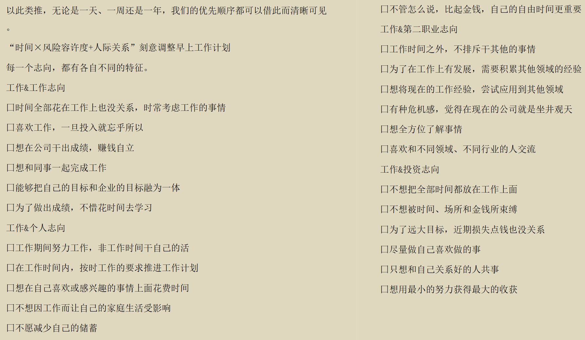
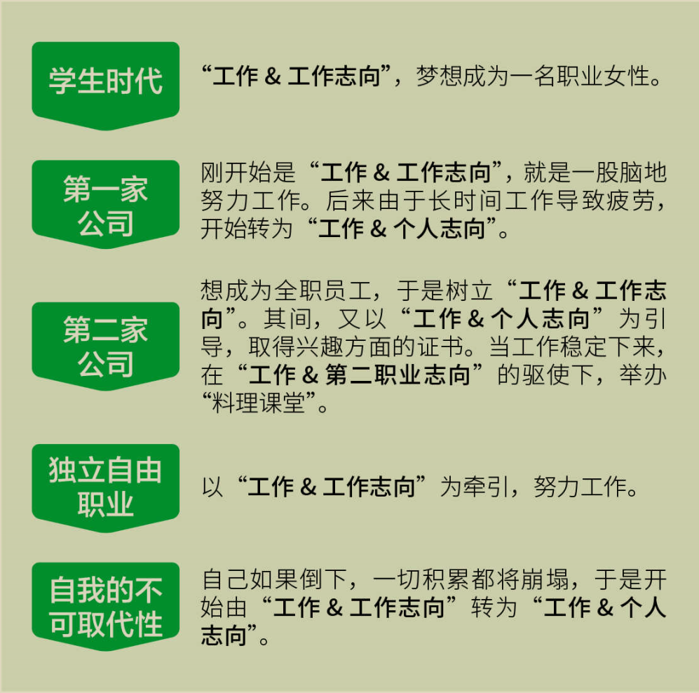

欢迎使用 **{小书匠}(xiaoshujiang)编辑器**，您可以通过 `小书匠主按钮>模板` 里的模板管理来改变新建文章的内容。

# 2022.10.07
今天算是开始了自己的第一次总结。
但是暂时还没有做到，因为快没有时间了。
## 今天做了什么？
早上7:30起床，大脑特别蒙。
8点多达到了工作室，感觉自己特别委屈，再加上时间还不是太紧，我开始自我放松和自我催眠，开始看视频或是看书，并把这个当做自己的心理安慰。
> 心理：看我又不是没有学，我只是在看书，我也是在学习了。不是吗。
> 这样一点点催眠自己，时间很快就过去了。

我其实看的很困，但是我不知道干什么，因为我不想开始，为什么抗拒，因为我脑袋里没有东西，我能写出来的唯一方式就是借鉴和抄，但是我匆匆忙忙地全部抄完，迷茫的画完，我还干了什么，我好想其他的什么都没有干过？所以我很抗拒写，但是呢我越不写，越有可能会抄，因为哪有那么多时间给你来纠结，因为害怕写不出来就干脆不写了吗。
请问问自己你应该做到哪一步？

# 2022.10.08
上午玩了半上午，又看了半上午的书，
人生不应该如此失败

我喜欢的话：
> 欣赏自己独特的性格，珍爱自己的成长经历，相信自觉，因为成功就在那里。
> ——洛维次《创业维艰》

我应该做什么？我能改变什么？
> * 重新审视此前的生活习惯
> * 确保充足的睡眠时间
> * 将重要的事情放在早上来做

信息过剩，这可太对了
因为我迷茫了，我不知道选择什么?

问题不是早起，是你工作前腾出1小时来思考和工作。
不要着急，不要追赶OK？

> 不管每天有多忙碌，都要确保自己有安静独处的时间。只有这样，才能让自己从焦虑而不知所措、逡巡不前的状态中释放出来。

按照重要性和紧迫感指定每天的工作计划，就是所谓的“早上固定时间”

“趁热打铁”——不浪费获取的知识而敢于实践，你的很多技能都有可能得到提升。

集中时间管理：30minx2的方式分两个节点集中做事
* 前30分钟做好一天的工作计划，一天中应该做的工作要取得什么样的效果，可以在这期间安排妥当。
* 一旦着手，也就能很快进入工作状态
* 后30min用来关注一些重要但并不紧急的事情。
* 如此一来，工作效率自然提高，自己也可以在想做的事中获得充实的快乐。

>  有人习惯于把事情往后推，觉得现在还早或者先做紧急的事，于是总是缺乏动力。岂不知眼前要做的事情其实永远也做不完，想着做完这件事后再如何如何，那么就不会看到完成的尽头。因此，面对那些虽然并不紧迫，但是于人生来说十分重要的“播种”一定要尽快来做，须知掌握计划性也是非常重要的。
>  对我未来的人生比较重要的事情是什么？
>  * 专业基础
>  * 算法能力
>  * 英语能力
>  * 生活习惯

> 近期我在想着做什么？
> 设计前端页面
> 完成后端交互
> 学习文件的上传和下载
> 完成报告的修改
> 背英语单词-复习此前背过的英语单词
> 列出详尽可行的英语学习计划-明确目标，为之努力
> 备考托福
> 学习吉他

每天早上1小时，把自己想要“播种”的东西具体化

> 确立优先顺序时要发现差异，找到参考规范，才能真正找到标杆。

对我们来说，现在要做的不是探索同一环境、同一境遇的人都在干什么，而是要确认自己的人生想怎么过，自己在什么样的状态下才感到幸福。也就是说，我们要尽早明确自己的志向，然后了解和你有着同样志向的人如何确定优先顺序并积极落实。

不是我该干什么，而是你想干什么？你现在的步伐能够达到自己想要的吗？
你是否做出改变，一点点进步？

我目前处于**临机应变型**（在业务时间内随机应变）

我可以把自己归为工作&个人志向类。
我目前的工作就是学习！
个人志向：我想把一些事情花在自己喜欢和感兴趣的东西上。

并不是什么事一旦决定就得始终坚持。也就是说，我们未必一旦决定某事，就必须
一直不改志向勇往直前。
每逢决策，都要立足当下，安排好优先顺序。可以参考下表：

方法告诉你了，该怎么做还是要看你自己？
如果生活中全部都是灌输式学习，教导式学习，那就太无趣了
