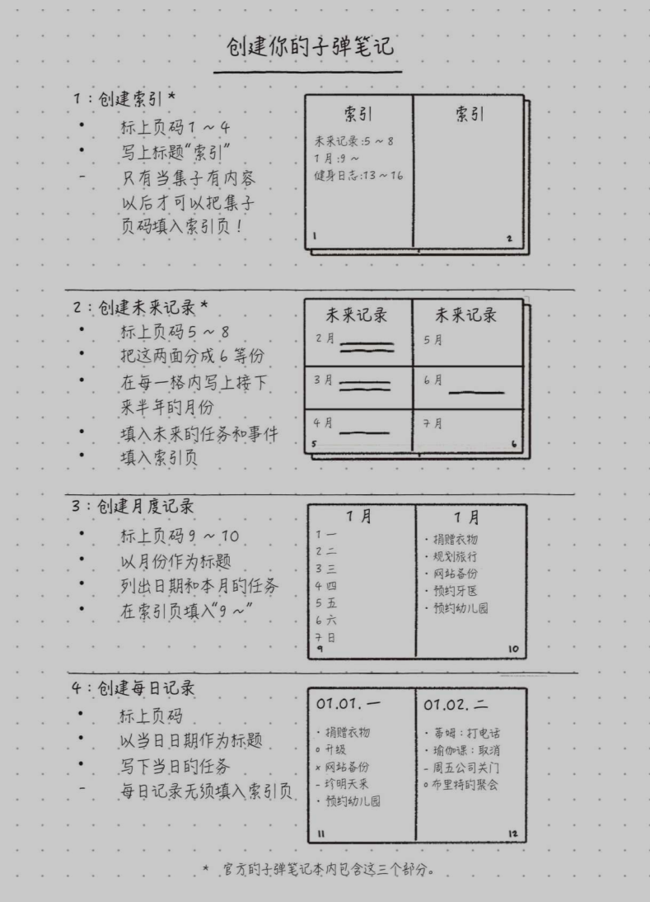

欢迎使用 **{小书匠}(xiaoshujiang)编辑器**，您可以通过 `小书匠主按钮>模板` 里的模板管理来改变新建文章的内容。

# 2022.10.07
今天算是开始了自己的第一次总结。
但是暂时还没有做到，因为快没有时间了。
## 今天做了什么？
早上7:30起床，大脑特别蒙。
8点多达到了工作室，感觉自己特别委屈，再加上时间还不是太紧，我开始自我放松和自我催眠，开始看视频或是看书，并把这个当做自己的心理安慰。
> 心理：看我又不是没有学，我只是在看书，我也是在学习了。不是吗。
> 这样一点点催眠自己，时间很快就过去了。

我其实看的很困，但是我不知道干什么，因为我不想开始，为什么抗拒，因为我脑袋里没有东西，我能写出来的唯一方式就是借鉴和抄，但是我匆匆忙忙地全部抄完，迷茫的画完，我还干了什么，我好想其他的什么都没有干过？所以我很抗拒写，但是呢我越不写，越有可能会抄，因为哪有那么多时间给你来纠结，因为害怕写不出来就干脆不写了吗。
请问问自己你应该做到哪一步？

# 2022.10.08
上午玩了半上午，又看了半上午的书，
人生不应该如此失败

我喜欢的话：
> 欣赏自己独特的性格，珍爱自己的成长经历，相信自觉，因为成功就在那里。
> ——洛维次《创业维艰》

我应该做什么？我能改变什么？
> * 重新审视此前的生活习惯
> * 确保充足的睡眠时间
> * 将重要的事情放在早上来做

信息过剩，这可太对了
因为我迷茫了，我不知道选择什么?

问题不是早起，是你工作前腾出1小时来思考和工作。
不要着急，不要追赶OK？

> 不管每天有多忙碌，都要确保自己有安静独处的时间。只有这样，才能让自己从焦虑而不知所措、逡巡不前的状态中释放出来。

按照重要性和紧迫感指定每天的工作计划，就是所谓的“早上固定时间”

“趁热打铁”——不浪费获取的知识而敢于实践，你的很多技能都有可能得到提升。

集中时间管理：30minx2的方式分两个节点集中做事
* 前30分钟做好一天的工作计划，一天中应该做的工作要取得什么样的效果，可以在这期间安排妥当。
* 一旦着手，也就能很快进入工作状态
* 后30min用来关注一些重要但并不紧急的事情。
* 如此一来，工作效率自然提高，自己也可以在想做的事中获得充实的快乐。

>  有人习惯于把事情往后推，觉得现在还早或者先做紧急的事，于是总是缺乏动力。岂不知眼前要做的事情其实永远也做不完，想着做完这件事后再如何如何，那么就不会看到完成的尽头。因此，面对那些虽然并不紧迫，但是于人生来说十分重要的“播种”一定要尽快来做，须知掌握计划性也是非常重要的。
>  对我未来的人生比较重要的事情是什么？
>  * 专业基础
>  * 算法能力
>  * 英语能力
>  * 生活习惯

> 近期我在想着做什么？
> 设计前端页面
> 完成后端交互
> 学习文件的上传和下载
> 完成报告的修改
> 背英语单词-复习此前背过的英语单词
> 列出详尽可行的英语学习计划-明确目标，为之努力
> 备考托福
> 学习吉他

每天早上1小时，把自己想要“播种”的东西具体化

> 确立优先顺序时要发现差异，找到参考规范，才能真正找到标杆。

对我们来说，现在要做的不是探索同一环境、同一境遇的人都在干什么，而是要确认自己的人生想怎么过，自己在什么样的状态下才感到幸福。也就是说，我们要尽早明确自己的志向，然后了解和你有着同样志向的人如何确定优先顺序并积极落实。

不是我该干什么，而是你想干什么？你现在的步伐能够达到自己想要的吗？
你是否做出改变，一点点进步？

我目前处于**临机应变型**（在业务时间内随机应变）

我可以把自己归为工作&个人志向类。
我目前的工作就是学习！
个人志向：我想把一些事情花在自己喜欢和感兴趣的东西上。

并不是什么事一旦决定就得始终坚持。也就是说，我们未必一旦决定某事，就必须
一直不改志向勇往直前。
每逢决策，都要立足当下，安排好优先顺序。可以参考下表：

方法告诉你了，该怎么做还是要看你自己？
如果生活中全部都是灌输式学习，教导式学习，那就太无趣了
我的志向是
“工作&个人志向”
- [ ] 工作时间努力工作，非工作时间做自己的事情。
- [ ] 在工作时间内，按时工作的要求，推进工作计划。
- [ ] 在自己喜欢或感兴趣的事情上面花费时间
- [ ] 不想因工作而让自己的家庭生活受影响
- [ ] 不愿减少自己的储蓄
- [ ] 不管怎么说，比起金钱，自己的时间更重要

如何划分自己的事情，如下：

> 一切按计划执行就不会有麻烦。比起最后着急忙慌，不如一早就计划得当。**如果是那种一早起来就说晚点再做的状态，我们岂能积极向前**？只有立即行动，即使在工作中被打断或者遇到紧急事件，也要立刻回归状态，展望未来。

反复提醒自己：
> 制定工作计划的7个好处
> * 形成决策习惯，行动高效
> 决策习惯就是明确自己的价值观和兴趣好恶，使自己形成瞬间决断的能力。
> 从小事做决策，比如吃饭，睡觉，看书。
> * 可以排除瞻前顾后、畏惧不前的心理
> 通过排除瞻前顾后的疑虑来消除时间虚耗。
> 只要觉得合适，不妨大胆去做。
> 在“早上1小时”的计划内，需要考虑各种事情。—— 注意限制时间
> * 可以预见自己的工作效果
>  加班时间的缩短、生产效率的提高和远程工作的推进等，一系列改革工作方式的话题频频成为热点新闻。也就是说，如何提高生产效率、减少加班时间成为人们讨论的焦点。在我看来，提高生产效率的关键，是明确每项工作的必然性与共有规律。
>  自己一个人包揽一堆工作，那么就会偏离理想设计，每项工作也不会那么如意。如果安排得凌乱，加班就可能成为常态甚至影响到自己的性格。如果不和相关人员进行具体比较，那怎么预估自己能力比较好，或者能否发现做事执着较真中的可取之处，总体上就会模糊不清。
>  无论是发送邮件还是准备资料，每个人的习惯做法都不一样。但是，工作效率高、正确性强的人，他们一般都会将理所当然的事情日常化，并为此创造一个可以共享的环境。如此一来，自己的效率显然会急剧提升。
>  即使被混杂的工作所烦恼，但只要让手头的工作具体化、可视化，也完全可以和那些高手比肩。通过对比，也会发现自己哪些地方还应该去除杂乱。此外，你还可以向前辈或水平高的人请教，具体问他们有什么好的建议或者他们是怎么处理工作的，通过请教也会受到良好的启发。这样，就会提高自己工作的正确性和预见性。
> 
> * 不会一直为工作纠缠
> * 可以完善自己工作的常见问题集
> 将自己的问题转为书面语，如果能这样，就可以实现以下几点：
（1）弄清楚自己应该掌握哪些技能。
（2）将问题转化成书面语言，便于其他人理解。
（3）以大家都能接受的形式使之实现标准化、体系化。
> * 分清有效加班和无效加班
> 是我，我该怎么办？
> * 可以每天集中精力
> “早上1小时”就是这样，可以让自己有意识地进入一种遵守规则的仪式感。
反复践行这种能让自己高效工作的方法，并将其作为早上的固定习惯，就会给自己带来积极的暗示。一旦习惯成自然，就会有更好的执行力。

> 我受不了，对，我就是受不了，也许我一个人的时候，我还有可能完成一项工作，但是在别人旁边我就是会感到难受，非常难受，我也不想行动。这不应该成为我的借口，但是我确实是这样，我感到很难受。
> 事实上，我感觉我在哪里都难受！！！

> 明天去图书馆吧，换个环境，而不是只能自怨自艾！

> 我可以先把系统的业务流程画在需求上，再根据老师的评价进行进一步修改。

#### 细化的内容
* 对

 
 > 个性化记录用来记录相关的信息，如引述的内容、要读的书、项目细节，等等。

-----

--------
# 10.14
自己是什么？

* 无论如何，我都依然无条件的接受自己。
* 小我——面对事情的不同态度
  “真正的勇士敢于面对惨淡的人生”
* 高我

* 和自己的意思连接？

我到底该怎么爱自己？
* **自我察觉**
	* 我的内心是怎么样的
	* **冥想**
* **自我接受和爱自己**
	* 如何安抚自己——你的安抚是谁？小苏
	* 只有接收自己，我才能有勇气改变。
* **自我诚实**
	* 听从自己的内心

教导太有高度了，所以我不知道该怎么把它应用到实际。
你的价值不在于你的完美，而在于你的独特。
为什么我会在寻找书籍的时候感到焦虑呢？
- 因为我的潜意识告诉我，我这样做没有
- 我需要做的应该是静下心来读一本书，把它化为自己行动的动力
- 我明白每下载一本书的时候，我总会有一种心理上的满足，所以我一直在最求的其实是那一瞬间的满足。

关于手机：
* 是否有意思？知道自己要干什么
* 是否能自控？能不能想停就停
* 自己感觉如何?
如何与手机和平相处？
* 了解网络科技中的上瘾机制
	* 欲罢不能
	* 上瘾
* 物理隔离
	* 与其依靠意志力战胜诱惑，不如直接远离诱惑
	* 永远不要考验人性
	* 打的赢就打，打不赢就走

